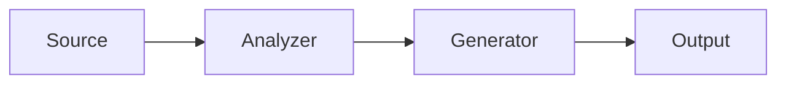
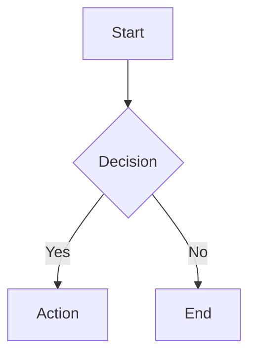

# Slides Generator - Technical Specification

## Project Overview

**slides-gen** is an AI-powered command-line tool for automated slide deck generation from markdown content. It leverages Claude Code, Marp, and MCP servers to create professional presentations with minimal manual effort.

## Core Technology Stack

### Primary Technologies
- **Language**: TypeScript/Node.js
- **Slide Framework**: Marp (Markdown Presentation Ecosystem)
- **Output Formats**: HTML, PDF, PPTX
- **AI Integration**: Claude Code + Model Context Protocol (MCP)
- **Package Manager**: npm
- **Build Tool**: tsc (TypeScript compiler)

### Key Dependencies
- `@marp-team/marp-cli` - Marp command-line interface
- `@marp-team/marp-core` - Core Marp engine
- `commander` - CLI framework
- `yaml` - YAML parsing for configuration
- `gray-matter` - Frontmatter parsing
- `chalk` - Terminal styling
- `ora` - Terminal spinners

### Development Dependencies
- `typescript` - TypeScript compiler
- `@types/node` - Node.js type definitions
- `vitest` - Testing framework (fast, modern, Vite-powered)
- `tsx` - TypeScript execution for development
- `eslint` + `prettier` - Code quality tools

## Architecture

### High-Level Flow

```
Content Directory → Analyzer → Planner → Generator → Compiler → Output
                        ↓          ↓          ↓
                    Claude     Claude     Claude + MCP
```

### Components

#### 1. **Content Analyzer**
- Reads content directory structure
- Parses markdown files with frontmatter
- Extracts metadata, headings, code blocks
- Identifies data files (CSV, JSON) for visualization
- Returns structured analysis object

#### 2. **Slide Planner**
- Takes analyzed content + config
- Determines optimal slide count and types
- Plans slide flow and structure
- Identifies where images/diagrams needed
- Outputs slide plan (JSON/YAML)

#### 3. **Slide Generator**
- Converts plan → Marp markdown
- Generates appropriate slide directives
- Integrates Mermaid diagrams
- Calls MCP servers for images (optional)
- Handles syntax highlighting for code
- Outputs complete Marp markdown file

#### 4. **Compiler**
- Invokes Marp CLI
- Converts markdown → HTML/PDF/PPTX
- Applies themes and styling
- Outputs final presentation files

## Configuration System

### Global Config (`config.yaml`)

```yaml
# Presentation settings
theme: default # default, gaia, uncover, or custom CSS path
aspect_ratio: "16:9" # or "4:3"
transition: fade # fade, slide, none
page_numbers: true
footer: ""

# Generation settings
tone: professional # professional, casual, technical, creative, academic
slide_types:
  - title
  - content
  - section
  - code
  - diagram

# Image settings
image_strategy: placeholder # placeholder, mcp_unsplash, local
image_mcp_server: null # MCP server name if using MCP

# Diagram settings
diagram_engine: mermaid # mermaid, or future: graphviz, plantuml

# Output settings
output_dir: ./output
formats:
  - html
  - pdf
```

### Per-File Frontmatter

```yaml
---
title: "My Presentation"
author: "John Doe"
date: 2026-01-04
theme: gaia
style: |
  section {
    background: linear-gradient(to bottom, #667eea 0%, #764ba2 100%);
  }
---
```

## Content Format

### Markdown Structure

Slides are separated by `---` (triple dash):

```markdown
---
<!-- Frontmatter -->
title: Introduction to TypeScript
theme: default
---

# Introduction to TypeScript
## A Modern JavaScript Superltype System

---

## Why TypeScript?

- Static type checking
- Better IDE support
- Scales to large codebases
- Gradual adoption path

---
type: code
language: typescript
---

## Type Annotations

```typescript
function greet(name: string): string {
  return `Hello, ${name}!`;
}
```

---
type: diagram
---

## Architecture Overview



---

# Questions?
```

### Slide Type Specifications

#### MVP Slide Types

**1. Title Slide**
```markdown
---
type: title
---

# Main Title
## Subtitle
### Author | Date
```

**2. Content Slide**
```markdown
---
type: content
layout: default # default, two-column, center
---

## Heading

- Bullet point 1
- Bullet point 2
  - Nested point
```

**3. Section Divider**
```markdown
---
type: section
background: #667eea
---

# Section Name
```

**4. Code Slide**
```markdown
---
type: code
language: typescript # auto-detect if not specified
highlight: 2-4 # optional line highlighting
---

## Code Example

```typescript
function example() {
  console.log("Hello");
}
```
```

**5. Diagram Slide**
```markdown
---
type: diagram
engine: mermaid
---

## Flowchart


```

## CLI Interface

### Command Structure

```bash
slides-gen <command> [options]
```

### MVP Commands

#### `init`
Initialize a new slides project in current directory.

```bash
slides-gen init [project-name]
```

Creates:
- `config.yaml`
- `content/` directory with sample markdown
- `themes/` directory with custom theme template
- `output/` directory
- `.gitignore`

#### `generate`
Generate slides from content directory.

```bash
slides-gen generate [content-dir] [options]

Options:
  -c, --config <path>    Config file (default: ./config.yaml)
  -o, --output <path>    Output directory (default: ./output)
  -f, --format <format>  Output format: html|pdf|pptx|all (default: html)
  -t, --theme <theme>    Theme to use (default: from config)
  -w, --watch            Watch mode for development
  --no-compile           Generate Marp markdown only, skip compilation
```

#### `preview`
Open generated slides in browser.

```bash
slides-gen preview [file]

Options:
  --port <port>    Dev server port (default: 8080)
```

#### `validate`
Validate content and configuration.

```bash
slides-gen validate [content-dir]

Options:
  -c, --config <path>    Config file to validate
```

### Future Commands (Post-MVP)

- `slides-gen add <type>` - Add new slide template to content
- `slides-gen theme create <name>` - Create custom theme
- `slides-gen export <format>` - Export to specific format
- `slides-gen serve` - Live preview server with hot reload

## Directory Structure

```
slides-gen/
├── src/
│   ├── cli/
│   │   ├── index.ts              # CLI entry point
│   │   ├── commands/
│   │   │   ├── init.ts
│   │   │   ├── generate.ts
│   │   │   ├── preview.ts
│   │   │   └── validate.ts
│   │   └── utils/
│   │       ├── logger.ts
│   │       └── config-loader.ts
│   ├── core/
│   │   ├── analyzer.ts           # Content analyzer
│   │   ├── planner.ts            # Slide planner
│   │   ├── generator.ts          # Marp markdown generator
│   │   └── compiler.ts           # Marp CLI wrapper
│   ├── slide-types/
│   │   ├── base.ts               # Base slide type interface
│   │   ├── title.ts
│   │   ├── content.ts
│   │   ├── section.ts
│   │   ├── code.ts
│   │   └── diagram.ts
│   ├── mcp/
│   │   ├── client.ts             # MCP client wrapper
│   │   └── image-provider.ts    # Image search via MCP
│   ├── types/
│   │   ├── config.ts             # Config type definitions
│   │   ├── slide.ts              # Slide type definitions
│   │   └── analysis.ts           # Analysis result types
│   └── utils/
│       ├── markdown.ts           # Markdown utilities
│       ├── mermaid.ts            # Mermaid diagram utilities
│       └── file.ts               # File system utilities
├── templates/
│   ├── config.yaml               # Default config template
│   ├── sample-content.md         # Sample content file
│   └── themes/
│       ├── professional.css
│       ├── creative.css
│       └── technical.css
├── tests/
│   ├── unit/
│   │   ├── analyzer.test.ts
│   │   ├── planner.test.ts
│   │   ├── generator.test.ts
│   │   └── compiler.test.ts
│   ├── integration/
│   │   └── end-to-end.test.ts
│   └── fixtures/
│       ├── sample-content/
│       └── expected-output/
├── .github/
│   ├── ISSUE_TEMPLATE/
│   │   ├── bug_report.md
│   │   └── feature_request.md
│   └── workflows/
│       ├── ci.yml
│       └── release.yml
├── docs/
│   ├── getting-started.md
│   ├── slide-types.md
│   ├── configuration.md
│   └── mcp-integration.md
├── package.json
├── tsconfig.json
├── .gitignore
├── .eslintrc.json
├── .prettierrc
├── README.md
├── CLAUDE.md
├── CONTRIBUTING.md
└── LICENSE
```

## Type Definitions

### Core Types

```typescript
// Config type
interface SlidesConfig {
  theme: string;
  aspectRatio: '16:9' | '4:3';
  transition: 'fade' | 'slide' | 'none';
  pageNumbers: boolean;
  footer?: string;
  tone: 'professional' | 'casual' | 'technical' | 'creative' | 'academic';
  slideTypes: string[];
  imageStrategy: 'placeholder' | 'mcp_unsplash' | 'local';
  imageMcpServer?: string;
  diagramEngine: 'mermaid';
  outputDir: string;
  formats: ('html' | 'pdf' | 'pptx')[];
}

// Slide type
interface Slide {
  type: 'title' | 'content' | 'section' | 'code' | 'diagram';
  content: string;
  metadata?: Record<string, any>;
}

// Analysis result
interface ContentAnalysis {
  files: AnalyzedFile[];
  totalSlides: number;
  suggestedStructure: SlideStructure;
  images: ImageRequirement[];
  diagrams: DiagramRequirement[];
  codeBlocks: CodeBlock[];
}

// Slide plan
interface SlidePlan {
  slides: PlannedSlide[];
  config: SlidesConfig;
  metadata: PresentationMetadata;
}
```

## Testing Strategy

### Unit Tests (Vitest)

- **Analyzer**: Test markdown parsing, frontmatter extraction
- **Planner**: Test slide structure generation logic
- **Generator**: Test Marp markdown generation
- **Compiler**: Test Marp CLI invocation (mocked)
- **Slide Types**: Test each slide type rendering

### Integration Tests

- **End-to-end**: Full flow from content → output
- **CLI Commands**: Test each command with real files
- **Config Loading**: Test various config scenarios

### Test Coverage Target

- Minimum 80% code coverage
- 100% coverage for core generator logic
- Integration test for each MVP feature

## MCP Integration

### Image Provider (Optional MVP Feature)

```typescript
interface MCPImageProvider {
  search(query: string, options?: ImageSearchOptions): Promise<ImageResult[]>;
}

// Example usage in generator
const images = await mcpClient.search('professional office', {
  count: 1,
  orientation: 'landscape'
});
```

### Future MCP Integrations

- Chart generation from data
- Icon libraries
- Stock photos
- Diagram templates

## Error Handling

### Error Categories

1. **User Errors**: Invalid config, missing files, bad markdown
2. **System Errors**: Marp CLI failures, file system issues
3. **Network Errors**: MCP server unavailable (graceful degradation)

### Error Reporting

- Clear, actionable error messages
- Suggestion for fixes where possible
- Validation before expensive operations
- Graceful degradation (e.g., placeholders if MCP fails)

## Performance Considerations

- **Lazy loading**: Only load Marp CLI when needed
- **Caching**: Cache MCP image results
- **Streaming**: Stream large file processing
- **Parallel processing**: Generate slides concurrently where possible

## Security Considerations

- **Input validation**: Sanitize markdown input
- **Path traversal**: Validate all file paths
- **Arbitrary code**: Sandboxed Mermaid rendering
- **MCP**: Only trusted MCP servers

## Deployment & Distribution

### NPM Package

```json
{
  "name": "slides-gen",
  "version": "0.1.0",
  "bin": {
    "slides-gen": "./dist/cli/index.js"
  },
  "files": [
    "dist/",
    "templates/"
  ]
}
```

### Installation

```bash
npm install -g slides-gen
```

### Release Process

1. Version bump (semantic versioning)
2. Run tests
3. Build TypeScript
4. Publish to npm
5. Create GitHub release

## MVP Scope

### Must Have (MVP)

- [x] CLI with `init`, `generate`, `preview`, `validate` commands
- [x] Content analyzer (markdown + frontmatter parsing)
- [x] Slide planner (basic structure generation)
- [x] Marp markdown generator
- [x] Marp compiler integration
- [x] Slide types: title, content, section, code, diagram
- [x] Mermaid diagram support
- [x] Syntax highlighting for code
- [x] HTML and PDF output
- [x] Basic themes (3 built-in)
- [x] Config file support (YAML)
- [x] Unit and integration tests
- [x] Documentation

### Should Have (Post-MVP v0.2)

- [ ] PPTX export
- [ ] MCP image integration
- [ ] Watch mode for development
- [ ] Two-column layouts
- [ ] Custom theme creation wizard
- [ ] More diagram types
- [ ] Speaker notes support

### Could Have (Future)

- [ ] MCQ/Quiz slides with interactivity
- [ ] Live preview server with hot reload
- [ ] Template marketplace
- [ ] Auto-generate from data files
- [ ] Multi-language support
- [ ] Accessibility features (WCAG compliance)
- [ ] Slide animations/transitions API
- [ ] Export to Google Slides
- [ ] Cloud storage integration

## Success Metrics

### MVP Success Criteria

1. Can generate basic presentation from markdown in < 10 seconds
2. Supports all 5 core slide types
3. Produces valid HTML and PDF output
4. 80%+ test coverage
5. Clear documentation for all commands
6. Works on macOS, Linux, Windows

### User Experience Goals

- Simple: Create slides with minimal configuration
- Fast: Generate presentations in seconds
- Flexible: Support various content types and styles
- Reliable: Consistent output, helpful error messages
- Maintainable: Clean code, well-tested, documented

## Timeline Estimate

*(Note: No specific time estimates as per guidelines)*

### Phase 1: Foundation
- Project setup (TypeScript, testing, linting)
- Core types and interfaces
- Basic CLI framework

### Phase 2: Core Features
- Content analyzer implementation
- Slide planner implementation
- Generator implementation

### Phase 3: Compilation & Output
- Marp compiler integration
- Theme system
- Output format handling

### Phase 4: Polish & Release
- Testing (unit + integration)
- Documentation
- Error handling improvements
- Release preparation

## Open Questions

1. Should we support custom slide type plugins?
2. How to handle very large presentations (100+ slides)?
3. Should we bundle Marp CLI or require separate installation?
4. Default behavior when MCP server is unavailable?
5. Support for slide fragments/incremental reveals?

## References

- [Marp Documentation](https://marpit.marp.app/)
- [Marp CLI](https://github.com/marp-team/marp-cli)
- [Mermaid Documentation](https://mermaid.js.org/)
- [Model Context Protocol](https://modelcontextprotocol.io/)
- [Commander.js](https://github.com/tj/commander.js)
