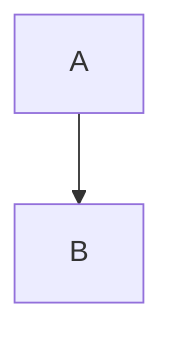

# TICKET-003: Content Analyzer Implementation

## Priority
HIGH - Core feature

## Status
Pending

## Description
Implement the content analyzer that reads markdown files, parses frontmatter, extracts slides, and analyzes the content structure.

## Dependencies
- TICKET-001 (Project Setup)
- TICKET-002 (Core Types)

## Acceptance Criteria

- [ ] Can parse markdown files with frontmatter using gray-matter
- [ ] Can split markdown into individual slides (by `---`)
- [ ] Extracts metadata from frontmatter
- [ ] Identifies slide types from content
- [ ] Detects code blocks with language
- [ ] Detects Mermaid diagrams
- [ ] Returns structured ContentAnalysis object
- [ ] Handles files without frontmatter gracefully
- [ ] Handles empty files gracefully
- [ ] All edge cases have unit tests
- [ ] Test coverage >= 90%

## Technical Details

### Files to Create

#### `src/core/analyzer.ts`
Main analyzer implementation with methods:
- `analyzeDirectory(dirPath: string): Promise<ContentAnalysis>`
- `analyzeFile(filePath: string): Promise<AnalyzedFile>`
- `parseMarkdown(content: string): ParsedSlide[]`
- `detectSlideType(content: string): SlideType`
- `extractCodeBlocks(content: string): CodeBlock[]`
- `extractDiagrams(content: string): DiagramRequirement[]`

#### `src/utils/markdown.ts`
Markdown parsing utilities:
- `splitIntoSlides(content: string): string[]`
- `extractHeadings(content: string): string[]`
- `countWords(content: string): number`

### Implementation Steps (TDD)

1. **Test**: Create `tests/unit/analyzer.test.ts`
   ```typescript
   describe('ContentAnalyzer', () => {
     describe('parseMarkdown()', () => {
       it('should split markdown by triple dash', () => {
         const markdown = '# Slide 1\n---\n# Slide 2';
         const analyzer = new ContentAnalyzer();
         const result = analyzer.parseMarkdown(markdown);
         expect(result).toHaveLength(2);
       });

       it('should parse frontmatter', () => {
         const markdown = '---\ntitle: Test\n---\n# Content';
         const analyzer = new ContentAnalyzer();
         const result = analyzer.parseMarkdown(markdown);
         expect(result[0].frontmatter?.title).toBe('Test');
       });
     });
   });
   ```

2. **Implement**: Create ContentAnalyzer class
   - Start with parseMarkdown (simplest)
   - Add frontmatter parsing with gray-matter
   - Add slide splitting logic
   - Add type detection

3. **Test**: Add tests for code block detection
   ```typescript
   it('should detect code blocks', () => {
     const markdown = '```typescript\nconst x = 1;\n```';
     const analyzer = new ContentAnalyzer();
     const blocks = analyzer.extractCodeBlocks(markdown);
     expect(blocks).toHaveLength(1);
     expect(blocks[0].language).toBe('typescript');
   });
   ```

4. **Implement**: Add code block detection

5. **Test**: Add tests for diagram detection
   ```typescript
   it('should detect mermaid diagrams', () => {
     const markdown = '```mermaid\ngraph TD\nA-->B\n```';
     const analyzer = new ContentAnalyzer();
     const diagrams = analyzer.extractDiagrams(markdown);
     expect(diagrams).toHaveLength(1);
   });
   ```

6. **Implement**: Add diagram detection

7. **Test**: Add integration test for full file analysis
   ```typescript
   it('should analyze complete markdown file', async () => {
     const filePath = 'tests/fixtures/sample.md';
     const analyzer = new ContentAnalyzer();
     const result = await analyzer.analyzeFile(filePath);
     expect(result.slides.length).toBeGreaterThan(0);
   });
   ```

8. **Implement**: Complete full analysis workflow

## Test Fixtures Needed

Create `tests/fixtures/sample-content/basic.md`:
```markdown
---
title: Test Presentation
---

# Title Slide
## Subtitle

---

## Content Slide

- Point 1
- Point 2

---

```typescript
function hello() {
  console.log("Hello");
}
```

---


```

## Definition of Done

- [ ] ContentAnalyzer class implemented
- [ ] All methods tested with unit tests
- [ ] Can parse real markdown files
- [ ] Handles all edge cases (empty, no frontmatter, etc.)
- [ ] Code blocks detected with language
- [ ] Mermaid diagrams detected
- [ ] Test coverage >= 90%
- [ ] Documentation comments on public methods

## Estimated Complexity
Medium - Requires careful markdown parsing

## Notes
- Use gray-matter library for frontmatter
- Consider edge cases: malformed markdown, empty slides
- Regex for code blocks: /```(\w+)?\n([\s\S]*?)```/g
- Mermaid blocks are just code blocks with language 'mermaid'
